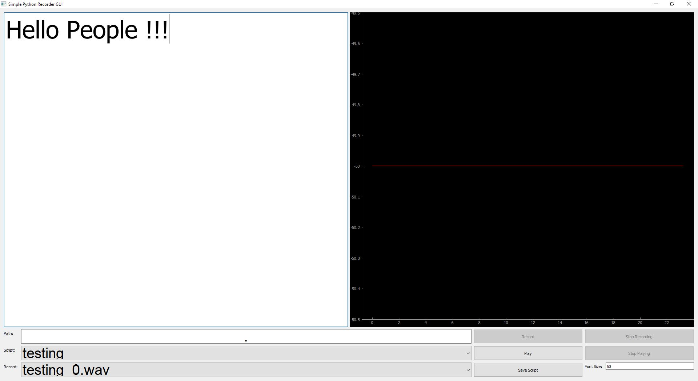

# Simple Python Recording App

This app allow user to read the txt.file and control the recording process in an interface
Tested on Ubuntu 16.04, windows 10


### Installation

```bash
conda env create -f environment.yml
# follow windows instructions on https://stackoverflow.com/questions/54998028/how-do-i-install-pyaudio-on-python-3-7
```

### Configuration

```python
cp demo_setting.yaml current_setting.yaml
#update your current_setting.yaml
python recording_app.py
```
